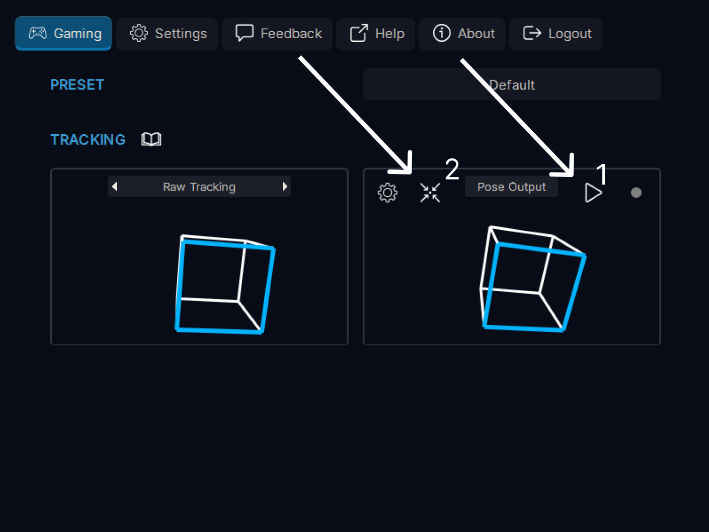
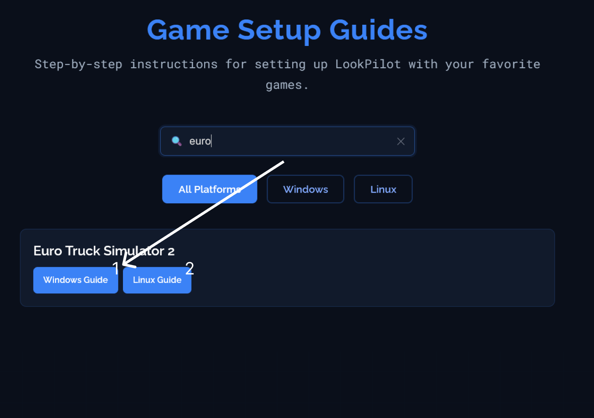
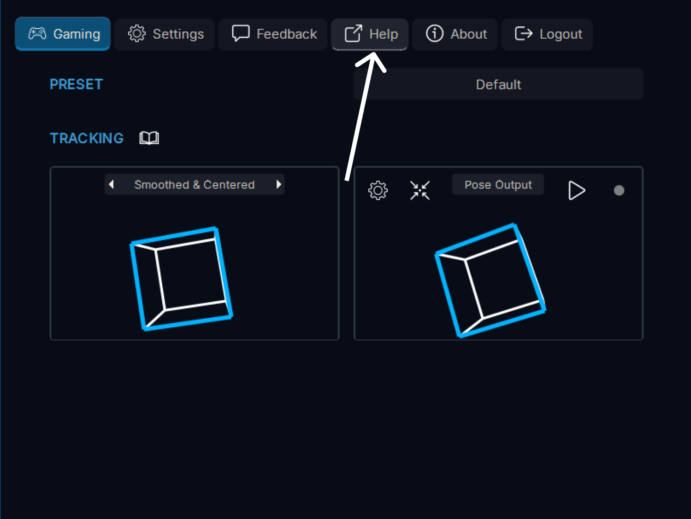

**Welcome to LookPilot!** This short guide will help you start tracking and get into your first game.

**⚠️ Important for Linux users:** If you have LookPilot installed via Steam, you must use the **.deb version of Steam** for LookPilot to work properly. Alternatively, you can install LookPilot standalone from [lookpilot.app/downloads](https://lookpilot.app/downloads).

## Camera setup

First, make sure your camera is connected. Go to **Settings** (1) → **Camera** (2), choose your webcam in the dropdown (3), then select a resolution and FPS (4). Higher FPS usually feels better, but image quality matters — don't pick the lowest resolution. Confirm you can see yourself in the preview.

## Start tracking

You're ready to start. Click **Start** button (1) or press `Alt+T` (customizable in Settings → Keybinds) in the output pose visualization to start tracking. If needed, re-center with the **Center** button (2) or press `Alt+C` (customizable in Settings → Keybinds). Then launch your game.

## Status indicator

To view tracking status, hover the indicator next to the start button in the output pose visualization. It shows connection status, the current game, and FPS (1).

## Open guides

Some games need a bit of setup. Open the **game-specific guides** by clicking the book icon next to the **Tracking** header in the Gaming tab (1).

## Find your game

Find your game and open the guide for your operating system — **Windows** (1) or **Linux** (2).

## Follow the guide

Here's an example guide. For **Euro Truck Simulator 2**, no extra setup is required — it should work out of the box.

## Customize your tracking experience

To customize your tracking experience, click the **Settings** button in the output pose visualization to open the **Tracking settings** window.

## Tracking settings

In the **Tracking settings** window, you can adjust all kinds of settings to customize your tracking experience. Toggle which axes you want to track, adjust the sensitivity and much more. You can inspect each setting by hovering over it to see a tooltip.

## Need more help?

That should be enough to get you started! For more detailed information or help, click the **Help** button to open more comprehensive guides. You can also join our [**Discord community**](https://discord.gg/RbhTxhFnCF) to get help, share feedback, report bugs, or just chat with other users. Welcome to LookPilot!

